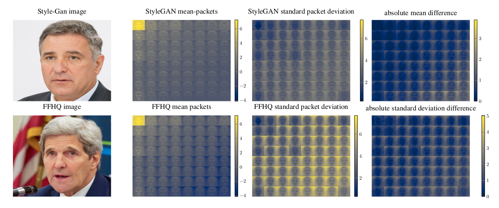

<!--
<p align="center">
  
</p>
-->


## Wavelet-Packets for Deepfake Image Analysis and Detection

<p align="center">
<a href="https://github.com/gan-police/frequency-forensics/actions/workflows/tests.yml">
    
<a href="https://github.com/psf/black">
    
</a>
</p>


This is the supplementary source code for our paper [Wavelet-Packets for Deepfake Image Analysis and Detection, Machine Learning, Special Issue of the ECML PKDD 2022 Journal Track](https://rdcu.be/cUIRt).



The plot above illustrates the fundamental principle.
It shows an FFHQ and a style-gan-generated image on the very left.
In the center and on the right, packet coefficients and their standard deviation are depicted.
We computed mean and standard deviation values using 5k images from each source.

## Installation

The latest code can be installed in development mode with:

```shell
$ git clone https://github.com/gan-police/frequency-forensics
$ cd frequency-forensics
$ pip install -e .
```

## Assets

### GAN Architectures

We utilize pre-trained models from the following repositories:

- [StyleGAN](https://github.com/NVlabs/stylegan)
- [GANFingerprints](https://github.com/ningyu1991/GANFingerprints)

For our wavelet-packet computations, we use the :
- [PyTorch-Wavelet-Toolbox: ptwt](https://github.com/v0lta/PyTorch-Wavelet-Toolbox)

In the paper, we compare our approach to the DCT-method from:
- [GANDCTAnalysis](https://github.com/RUB-SysSec/GANDCTAnalysis)

### Datasets

We utilize three datasets that commonly appeared in previous work:

- [FFHQ](https://github.com/NVlabs/ffhq-dataset)
- [CelebA](http://mmlab.ie.cuhk.edu.hk/projects/CelebA.html)
- [LSUN bedroom](https://github.com/fyu/lsun)

## Reproduction

The following section of the README serves as a guide to reproducing our paper. Data for the 128 pixel FFHQ-Stylegan pair is available via
[google-drive](https://drive.google.com/file/d/1MOHKuEVqURfCKAN9dwp1o2tuR19OTQCF/view?usp=sharing) [4.2GB] .

### Preparation

We work with images of the size 128x128 pixels. Hence, the raw images gave to be cropped
and/or resized to this size. To do this, run `freqdect.crop_celeba` or `freqdect.crop_lsun`, depending on the dataset.
This will create a new folder with the transformed images. The FFHQ dataset is already distributed in the required image
size.

Use the pretrained GAN-models to generate images. In case of StyleGAN, there is only a pre-trained model generating
images of size 1024x1024, so one has to resize the GAN-generated images to size 128x128 pixels, e.g. by inserting

```python
PIL.Image.fromarray(images[0], 'RGB').resize((128, 128)).save(png_filename)
```

into
the [ffhq-stylegan](https://github.com/NVlabs/stylegan/blob/03563d18a0cf8d67d897cc61e44479267968716b/pretrained_example.py)
.

Store all images (cropped original and GAN-generated) in a separate subdirectories of a directory, i.e. the directory
structure should look like this

```
source_data
 ├── A_original
 ├── B_CramerGAN
 ├── C_MMDGAN
 ├── D_ProGAN
 └── E_SNGAN
```

For the FFHQ case, we have only two subdirectories: `ffhq_stylegan/A_ffhq` and `ffhq_stylegan/B_stylegan`. The prefixes
of the folders are important, since the directories get the labels in lexicographic order of their prefix, i.e.
directory `A_...` gets label 0, `B_...` label 1, etc.

Now, to prepare the data sets run `freqdect.prepare_dataset` . It reads in the data set, splits them into a training,
validation and test set, applies the specified transformation (to wavelet packets, log-scaled wavelet packets or just
the raw image data) and stores the result as numpy arrays.

Afterwards run e.g.:

```shell
$ python -m freqdect.prepare_dataset ./data/source_data/ --log-packets 
$ python -m freqdect.prepare_dataset ./data/source_data/
```

The dataset preparation script accepts additional arguments. For example, it is possible to change the sizes of the
train, test or validation sets. For a list of all optional arguments, open the help page via the `-h` argument.

### Training the Classifier

Now you should be able to train a classifier using for example:

```shell
$ python -m freqdect.train_classifier \
    --data-prefix ./data/source_data_log_packets_haar_reflect_3 \
    --calc-normalization \
    --features packets
```

This trains a regression classifier using default hyperparameters. The training, validation and test accuracy and loss
values are stored in a file placed in a `log` folder. The state dict of the trained model is stored there as well. For a
list of all optional arguments, open the help page via the `-h` argument.

### Evaluating the Classifier

#### Plotting the Metrics

To plot the accuracy results, run:

```shell
$ python -m freqdect.plot_accuracy_results {shared, lsun, celeba} {regression, CNN} ...
```

For a list of all optional arguments, open the help page via the `-h` argument.

#### Calculating the confusion matrix

To calculate the confusion matrix, run `freqdect.confusion_matrix`. For a list of all arguments, open the help page via
the `-h` argument.

## ⚖️ Licensing

This project is licensed under the [GNU GPLv3 license](LICENSE)

## Acknowledgements

### 📖 Citation
If you find this work useful please consider citing:
```
@misc{wolter2021waveletpacket,
      title={Wavelet-Packet Powered Deepfake Image Detection}, 
      author={Moritz Wolter and Felix Blanke and Raoul Heese and Jochen Garcke},
      year={2022},
      eprint={2106.09369},
      archivePrefix={arXiv},
      primaryClass={cs.CV}
}
```

### 🙏 Support

This project has been supported by the following organizations (in alphabetical order):

- [Fraunhofer Institute for Algorithms and Scientific Computing (SCAI)](https://www.scai.fraunhofer.de)
- [Fraunhofer Cluster of Excellence Cognitive Internet Technologies (CCIT)](https://www.cit.fraunhofer.de/en.html)

### 🍪 Cookiecutter

This package was created with [@audreyfeldroy](https://github.com/audreyfeldroy)'s
[cookiecutter](https://github.com/cookiecutter/cookiecutter) package using [@cthoyt](https://github.com/cthoyt)'s
[cookiecutter-snekpack](https://github.com/cthoyt/cookiecutter-snekpack) template.
